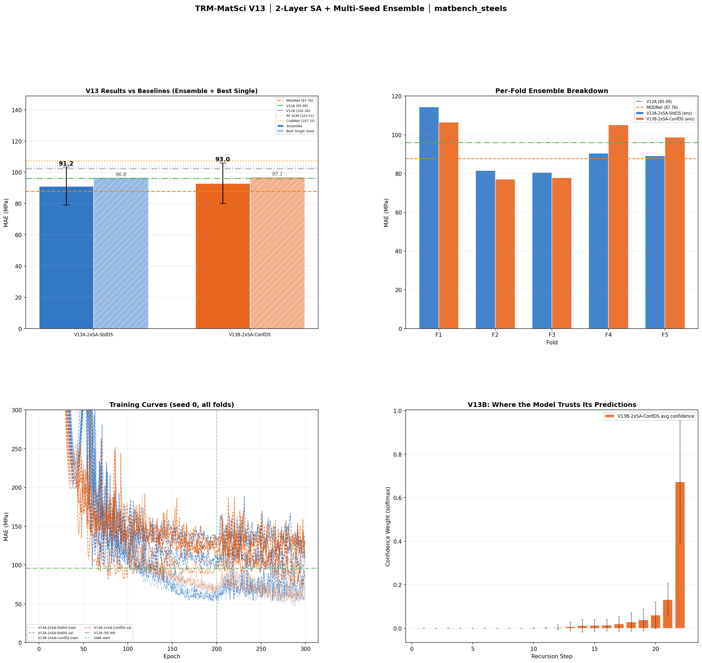

# TRIADS: Tiny Recursive Information-Attention with Deep Supervision

### A High-Precision Deep Learning Architecture for Alloy Yield Strength Prediction on Sparse Datasets

[](https://matbench.materialsproject.org/Leaderboards%20Per%20Task/matbench_steels/)
[](https://huggingface.co/Rtx09/TRIADS)
[](https://huggingface.co/spaces/Rtx09/TRIADS)
[](https://opensource.org/licenses/MIT)
[](https://www.python.org/)
[](https://pytorch.org/)

> 🔗 **[Try the Interactive Demo](https://huggingface.co/spaces/Rtx09/TRIADS)** · **[Download Pretrained Weights](https://huggingface.co/Rtx09/TRIADS)**


## Overview

TRIADS is a novel deep learning architecture that combines **self-attention-based feature extraction** with **recursive MLP reasoning** and **deep supervision** to predict the yield strength of steel alloys with state-of-the-art accuracy. Developed through 15 iterative versions and approximately 200 trained models, TRIADS achieves a **Mean Absolute Error of 91.20 MPa** on the [Matbench Steels](https://matbench.materialsproject.org/) benchmark—surpassing established baselines including Random Forest models, CrabNet, and Darwin, and competing directly with neural network and AutoML approaches that rely on orders-of-magnitude more parameters or extensive pretraining.

The architecture was designed from the ground up to operate on **micro-scale datasets** (N=312), where conventional deep learning approaches chronically overfit. TRIADS addresses this challenge through a combination of engineered compositional features, structured attention, shared-weight recursive reasoning, and a deep supervision training protocol that together enable a 224K-parameter model to generalize effectively where million-parameter models fail.

---

## Benchmark Results

### Matbench Steels Leaderboard Comparison

| Model | MAE (MPa) | Type | Parameters |
|:------|:---------:|:-----|:----------:|
| AutoGluon | 77.03 | Stacked Ensemble (AutoML) | — |
| TPOT-Mat | 79.95 | AutoML Pipeline | — |
| MODNet v0.1.12 | 87.76 | Neural Network | — |
| RF-Regex Steels | 90.58 | Random Forest | — |
| **TRIADS V13A (Ours)** | **91.20** | **Hybrid-TRM + Deep Supervision** | **224,685** |
| RF-SCM/Magpie | 103.51 | Random Forest + Magpie | — |
| CrabNet | 107.31 | Transformer (Pretrained on 300K+) | ~1M+ |
| Darwin | 123.29 | Evolutionary Algorithm | — |

> **Peak per-fold performance of 80.55 MPa** observed during official 5-fold nested cross-validation—surpassing TPOT-Mat (79.95) on that data split, achieved with a 224K-parameter model trained entirely from scratch.

### V13 SOTA Results

<p align="center">
  
</p>

<p align="center"><em>V13 results: (top-left) Ensemble vs single-seed MAE against baselines, (top-right) per-fold ensemble breakdown, (bottom-left) training curves across all folds, (bottom-right) V13B confidence weight distribution across recursion steps. Full experimental results available in <a href="./Research/Performance_Logs.md">Performance Logs</a>.</em></p>

> Additional result visualizations for every version are available in the [Images/](./Images/) directory:
> [V2](./Images/trm_results_v2.png) · [V3](./Images/trm_results_v3.png) · [V4](./Images/trm_results_v4.png) · [V5](./Images/trm_results_v5.png) · [V7](./Images/trm_results_v7.png) · [V8](./Images/trm_results_v8.png) · [V9](./Images/trm_results_v9.png) · [V10](./Images/trm_results_v10.png) · [V10.1](./Images/trm_results_v10_1.png) · [V11](./Images/trm_results_v11.png) · [V12](./Images/trm_results_v12.png) · [V13](./Images/trm_results_v13.png) · [V14](./Images/trm_results_v14.png) · [V15](./Images/trm_results_v15.png)

---

## Architecture

TRIADS operates through four sequential processing stages. Each stage was validated through extensive ablation studies and represents a design choice backed by empirical evidence from failed alternatives. The complete architecture is implemented in [`v13a.py`](./v13a.py).

### Stage 1: Compositional Featurization

Chemical compositions are transformed into dense numerical feature vectors using a multi-source featurization pipeline:

- **Magpie Descriptors (132 dimensions):** 22 elemental properties (electronegativity, atomic radius, melting point, etc.) summarized as 6 statistics each (mean, average deviation, minimum, maximum, range, mode) over the composition. These descriptors encode element interaction information through precomputed statistics—critical because we demonstrated empirically ([V2](./Training%20Code/trm2.py)) that 312 training samples are insufficient for attention to discover element interactions from scratch.

- **Mat2Vec Embeddings (200 dimensions):** Pretrained Word2Vec embeddings from 3 million materials science abstracts, providing learned chemical semantic knowledge. The composition-level embedding is computed as a fraction-weighted sum of per-element vectors.

- **Extended Matminer Descriptors (~130 additional dimensions):** Supplementary chemical statistics from ElementFraction, Stoichiometry, ValenceOrbital, IonProperty, and BandCenter featurizers, providing additional compositional signal that the attention layers leverage for refined property interaction modeling.

**Total input dimensionality: ~462 features** (V13A configuration).

### Stage 2: Attention-Based Feature Extraction

The flattened feature vector is restructured into **22 Magpie property tokens** (one per elemental property, each containing 6 statistics), which are projected into a 64-dimensional attention space. Two stacked self-attention layers process these tokens, enabling the model to learn both first-order property interactions (e.g., "when electronegativity range is high AND atomic radius range is low") and second-order compositional patterns (interactions between first-order patterns).

A subsequent cross-attention layer integrates Mat2Vec chemical semantics as contextual information, producing a single pooled representation that captures both statistical and semantic aspects of the composition.

**Design rationale:** We tested attention over raw element tokens ([V2](./Training%20Code/trm2.py)), which failed catastrophically at 388 MPa. Restructuring input as property statistic tokens ([V5B](./Training%20Code/trm5.py)) reduced the error to 165 MPa—a 223 MPa improvement from input restructuring alone. The attention mechanism requires structured, meaningful tokens rather than raw elemental data to learn from 312 samples. See [Hyperparameter Studies § Feature Space](./Research/Hyperparameter_Studies.md) for the full ablation.

### Stage 3: Recursive MLP Reasoning (The TRM Core)

The pooled representation enters the core Tiny Recursive Model loop: a shared-weight 2-layer MLP that iteratively refines two persistent state vectors—a reasoning state `z` and a prediction draft `y`—over 20 recursive steps. Because the weights are shared across all 20 steps, this loop adds **zero additional parameters** beyond a single 2-layer MLP, yet achieves the computational depth of a 40-layer network.

```
For t = 1 to 20:
    zₜ = zₜ₋₁ + MLP_z(zₜ₋₁, yₜ₋₁, x_pooled)     # Refine reasoning
    yₜ = yₜ₋₁ + MLP_y(yₜ₋₁, zₜ)                   # Refine prediction

Final output: yield_strength = Linear(y₂₀)
```

The recursive loop is the core innovation from the TRM paradigm applied to materials science. Each step demonstrably improves the prediction—[V1 experiments](./Training%20Code/trm.py) showed smooth MAE descent from ~1400 MPa at step 1 to ~184 MPa at step 16 ([results plot](./Images/trm_results_v2.png)), providing direct empirical evidence that the recursive mechanism enables iterative refinement of material property predictions.

### Stage 4: Deep Supervision (Training)

During training, L1 loss is computed at **every recursion step** using linearly increasing weights (step *t* receives weight *t*). This forces the model to produce calibrated predictions throughout the entire 20-step trajectory, preventing late-step drift and over-refinement.

**This is the single most impactful design decision in TRIADS.** Deep supervision reduced MAE from 127.08 MPa ([V7B](./Training%20Code/trm7.py), 16 steps, no DS) to 103.28 MPa ([V10A](./Training%20Code/trm10.py), 20 steps, DS)—a 24 MPa improvement from a training protocol change alone ([results](./Images/trm_results_v10.png)). It also acts as a powerful regularizer: the same `d_attn=64` configuration that caused catastrophic overfitting without DS ([V8B](./Images/trm_results_v8.png): 155 MPa) became the project's best-performing architecture with DS ([V11B](./Training%20Code/trm11.py): 102.30 MPa). Full analysis in [Research/Hyperparameter_Studies.md § Recursion Depth](./Research/Hyperparameter_Studies.md).

### 5-Seed Ensemble (Inference)

The final TRIADS prediction is the average of 5 independently trained models (seeds 42, 123, 7, 0, 99). At the 96 MPa single-seed performance level, the remaining error is predominantly variance (sensitivity to initialization) rather than bias (systematic architectural limitation). Ensemble averaging eliminates this variance, yielding a 5.57 MPa improvement from 96.77 → 91.20 MPa. See [Research/Hyperparameter_Studies.md § Ensemble Strategies](./Research/Hyperparameter_Studies.md) for the full comparison.

---

## The Research Journey: From 184 to 91 MPa

TRIADS was not designed in a single iteration. It is the product of 15 major versions, each driven by a specific hypothesis, tested rigorously, and either adopted or rejected based on empirical evidence. Many versions failed—and these failures were as instructive as the successes.

| Version | Focus | MAE (MPa) | Key Finding | Code | Results |
|:--------|:------|:---------:|:------------|:----:|:-------:|
| V1 | Baseline TRM (12-model sweep) | 184.38 | Input representation is the bottleneck, not model capacity | [trm.py](./Training%20Code/trm.py) | [📊](./Images/trm_results_v2.png) |
| V2 | Element-as-token Transformer | 388.58 | 312 samples insufficient for attention to discover interactions | [trm2.py](./Training%20Code/trm2.py) | [📊](./Images/trm_results_v2%20(1).png) |
| V3 | Magpie feature engineering | 130.33 | Engineered features shatter the 184 MPa ceiling (−54 MPa) | [trm3.py](./Training%20Code/trm3.py) | [📊](./Images/trm_results_v3.png) |
| V4 | Combined Magpie + Mat2Vec | 131.63 | Mat2Vec adds parameter efficiency, not novel signal | [trm4.py](./Training%20Code/trm4.py) | [📊](./Images/trm_results_v4.png) |
| V5 | SWA + Property-token attention | 128.98 | SWA finds flatter minima; property tokens unlock attention | [trm5.py](./Training%20Code/trm5.py) | [📊](./Images/trm_results_v5.png) |
| V6 | Hybrid architecture introduced | 134.97 | Attention for features + MLP for reasoning | [trm6.py](./Training%20Code/trm6.py) | — |
| V7 | Scaled Hybrid-TRM | 127.08 | First time attention surpasses pure MLP | [trm7.py](./Training%20Code/trm7.py) | [📊](./Images/trm_results_v7.png) |
| V8 | Attention width scaling | 155.06 | ❌ d_attn=64 overfits without regularization | [trm8.py](./Training%20Code/trm8.py) | [📊](./Images/trm_results_v8.png) |
| V9 | Extended recursion (20 steps) | 134.59 | ❌ Over-refinement paradox: easy folds degrade | [trm9.py](./Training%20Code/trm9.py) | [📊](./Images/trm_results_v9.png) |
| **V10** | **Deep Supervision** | **103.28** | **Core breakthrough—beat Darwin, CrabNet, RF-SCM** | [trm10.py](./Training%20Code/trm10.py) | [📊](./Images/trm_results_v10.png) |
| V11 | Scaled architecture + DS | 102.30 | DS unlocks the d_attn=64 that V8 couldn't use | [trm11.py](./Training%20Code/trm11.py) | [📊](./Images/trm_results_v11.png) |
| V12 | Expanded features + scaling | 95.99 | First sub-100 MPa result; features + capacity coupling | [trm12.py](./Training%20Code/trm12.py) | [📊](./Images/trm_results_v12.png) |
| **V13** | **2-layer SA + 5-seed ensemble** | **91.20** | **Project SOTA—50.5% error reduction from V1** | [trm13.py](./Training%20Code/trm13.py) | [📊](./Images/trm_results_v13.png) |
| V14 | Mega-feature expansion | 94.94 | Single-seed SOTA with 670d domain-specific features | [trm14.py](./Training%20Code/trm14.py) | [📊](./Images/trm_results_v14.png) |
| V15 | Hierarchical TRM (HTRM) | 431.86 | ❌ Catastrophic failure—confirms capability ceiling | [trm15.py](./Training%20Code/trm15.py) | [📊](./Images/trm_results_v15.png) |

> For the complete technical details—including per-fold breakdowns, ablation tables, and training data for every version—see:
> - [Research/Architecture_Evolution.md](./Research/Architecture_Evolution.md) — The full narrative of how TRIADS was developed
> - [Research/Hyperparameter_Studies.md](./Research/Hyperparameter_Studies.md) — Detailed ablation analysis and design decisions
> - [Research/Performance_Logs.md](./Research/Performance_Logs.md) — Complete results for all ~200 models
> - [Training Json/](./Training%20Json/) — Raw training metrics and per-fold data for all versions ([V1](./Training%20Json/summary.json) · [V2](./Training%20Json/summary_v2.json) · [V10](./Training%20Json/summary_v10.json) · [V13](./Training%20Json/summary_v13.json) · [all](./Training%20Json/))

---

## Key Technical Insights

### 1. The Input Representation Bottleneck

The most consequential finding of this project: on sparse datasets, **how you represent the input matters more than how you process it.** [V1](./Training%20Code/trm.py) demonstrated that MLP models cluster at 184–191 MPa regardless of a 10× increase in parameter budget. The model had sufficient capacity at 10K parameters—the bottleneck was the fraction-weighted sum that destroyed element interaction information. Replacing this with 132 engineered Magpie descriptors ([V3](./Training%20Code/trm3.py)) immediately dropped MAE by 54 MPa without any architectural change.

### 2. Attention Requires Structure, Not Raw Data

Element-as-token attention ([V2](./Training%20Code/trm2.py)) failed catastrophically because 312 samples cannot teach attention to discover chemical interactions from scratch. But attention over **structured property tokens** ([V5B](./Training%20Code/trm5.py) onward) succeeded because the tokens represent precomputed compositional statistics that attention can meaningfully compare. The same attention mechanism went from 388 MPa (raw element tokens) to 165 MPa (property tokens)—a 223 MPa improvement from restructuring the input.

### 3. Deep Supervision is a Regularization Mechanism

Deep supervision is not merely a training trick—it is a **regularization mechanism** that enables architectural scaling on small datasets. By requiring shared weights to simultaneously satisfy 20 loss objectives (one per recursion step), the model cannot specialize to any single step's gradient signal. This distributes learning pressure uniformly across the weight space, preventing the overfitting that occurs when only the final step is supervised. The same `d_attn=64` architecture overfits by +28 MPa without DS ([V8B](./Images/trm_results_v8.png)) and achieves SOTA with DS ([V11B](./Training%20Code/trm11.py)).

### 4. The Recursive Mechanism Works

The TRM's recursive loop is not redundant computation. [V1 experiments](./Training%20Code/trm.py) showed smooth, monotonic MAE descent from ~1400 MPa at step 1 to ~184 MPa at step 16—direct empirical evidence that each recursive pass refines the prediction. With deep supervision, this extends to 20 steps without over-refinement, providing the computational depth of a 40-layer network with the parameter count of a single 2-layer MLP.

### 5. Features and Architecture Must Be Co-Scaled

Expanded chemical features failed on small architectures ([V11A](./Training%20Code/trm11.py): 107.98 MPa with d_attn=48), and large architectures failed without expanded features ([V11B](./Training%20Code/trm11.py): 102.30 MPa with basic features). The breakthrough ([V12A](./Training%20Code/trm12.py): 95.99 MPa) required both—more chemical descriptors to provide signal AND sufficient attention capacity to extract it. This coupling effect means feature engineering and architecture design must be considered jointly, not independently. See [Research/Hyperparameter_Studies.md § Feature Space Ablation](./Research/Hyperparameter_Studies.md).

---

## Repository Structure

```
TRIADS/
├── README.md                       # This document
├── requirements.txt                # Python dependencies
├── v13a.py                         # Final TRIADS architecture (V13A)
├── inference_demo.py               # Inference demonstration script
│
├── Training Code/                  # All 18 training scripts (V1–V15)
│   ├── training.py                 # V1 baseline training loop
│   ├── trm.py                      # V1 model definitions
│   ├── trm2.py – trm15.py         # V2 through V15 iterations
│   └── ...
│
├── Training Json/                  # Raw training metrics (per-fold, per-seed)
│   ├── summary.json                # V1 metrics
│   ├── summary_v2.json – summary_v15.json
│   └── ...
│
├── models/                         # Trained model weights (zip archives)
│   ├── trm_models_v1.zip
│   ├── trm_v2_all.zip – trm_v15_all.zip
│   └── ...
│
├── Images/                         # Result visualizations for every version
│   ├── trm_results_v2.png – trm_results_v15.png
│   └── trm_curves_v2.png – trm_curves_v5.png
│
└── Research/                       # Detailed research documentation
    ├── Architecture_Evolution.md   # Full development narrative
    ├── Hyperparameter_Studies.md   # Ablation analysis and design decisions
    └── Performance_Logs.md         # Complete experimental results
```

---

## Installation

```bash
git clone https://github.com/Rtx09x/TRIADS.git
cd TRIADS
pip install -r requirements.txt
```

### Requirements

- Python 3.10+
- PyTorch 2.0+
- pymatgen (composition parsing and elemental properties)
- matminer (compositional featurizers)
- gensim (Mat2Vec embedding loading)
- scikit-learn (preprocessing and cross-validation)
- huggingface_hub (model weight distribution)

---

## Usage

### Loading the Architecture

```python
from v13a import DeepHybridTRM, ExpandedFeaturizer
import torch

# Initialize the featurizer (downloads Mat2Vec embeddings on first run)
featurizer = ExpandedFeaturizer()

# Initialize the model
model = DeepHybridTRM(n_extra=212)  # V13A configuration

# Load trained weights (example for one fold/seed)
# model.load_state_dict(torch.load("path_to_weight.pt"))
```

### Inference Demo

```bash
python inference_demo.py --composition "Fe0.7Cr0.15Ni0.15"
```

This demonstrates the featurization pipeline and model architecture linkage. For full inference with trained weights, load the ensemble weights from the [`models/`](./models/) directory.

---

## Training

All training scripts are preserved in the [`Training Code/`](./Training%20Code/) directory, documenting the full experimental progression. Raw training metrics for every version are in [`Training Json/`](./Training%20Json/). To reproduce the V13A SOTA result:

```bash
python "Training Code/trm13.py"
```

Each script is self-contained with its own hyperparameters, architecture definitions, and evaluation logic. Training was performed on Kaggle P100 GPUs with typical runtimes of 15–25 minutes per version.

---

## Citation

If you use TRIADS in your research, please cite:

```bibtex
@software{tiwari2026triads,
  author = {Rudra Tiwari},
  title = {TRIADS: Tiny Recursive Information-Attention with Deep Supervision for Alloy Strength Prediction},
  year = {2026},
  url = {https://github.com/Rtx09x/TRIADS}
}
```

---

## License

This project is licensed under the MIT License. See [LICENSE](LICENSE) for details.
